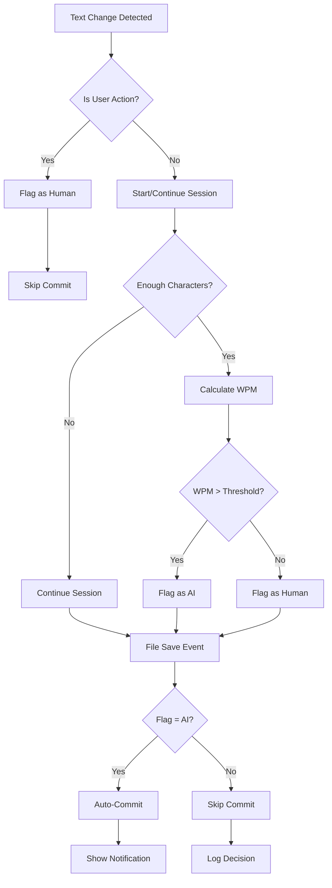
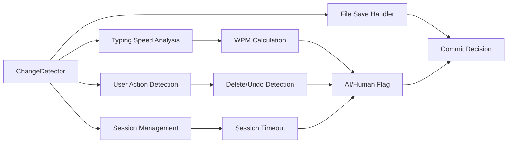
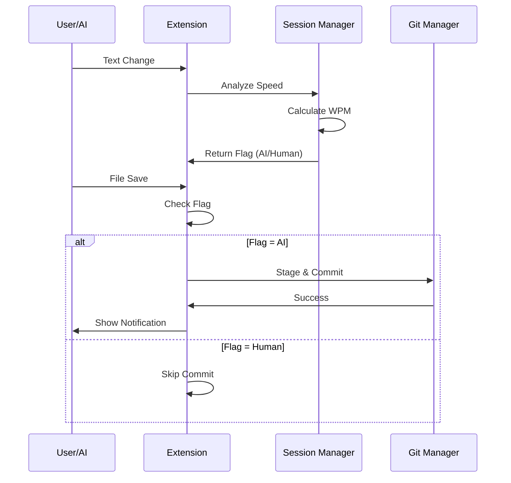
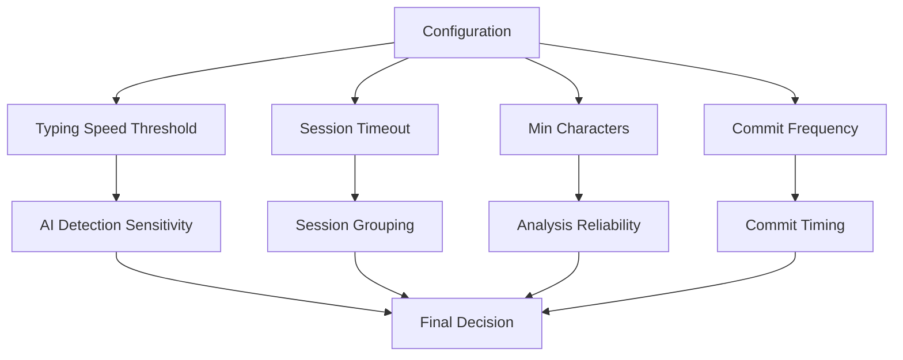

# Architecture Diagram

## Heuristic Logic Flow

## Component Overview

## Data Flow

## Configuration Impact

## Key Classes

- **ChangeDetector**: Main heuristic logic controller
- **GitManager**: Handles git operations and commit messages
- **SessionManager**: Manages typing sessions and WPM calculation
- **UserActionDetector**: Identifies human-only actions

## State Management

- **isHumanTyping**: Boolean flag for current typing mode
- **currentSession**: Active typing session data
- **typingSessions**: History of recent sessions
- **pendingChanges**: File-specific change tracking

---

*This diagram shows the high-level architecture and data flow of the heuristic detection system.*

